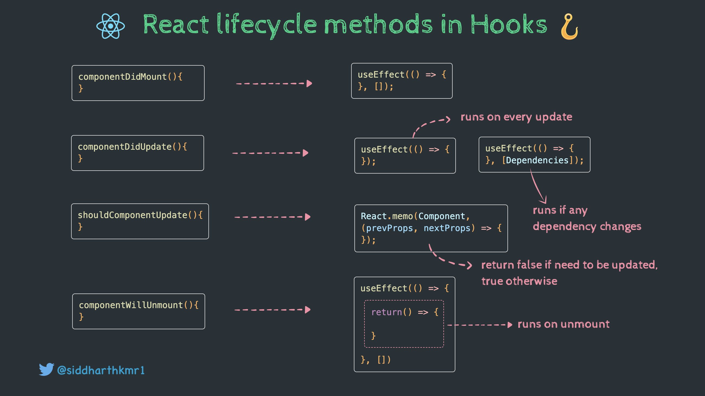

# Estado y ciclo de vida con React.Component

## React Class Component vs useState

- Los _class components_ pueden recibir _props_ de igual manera que los _functional components_.
- Los _class components_ sólo tienen un único _state_, el cual es un objeto con las propiedades que se necesiten.

      export class ClassState extends Component<ClassStateProps, ClassStateState> {
        constructor(props: ClassStateProps) {
          super(props);

          this.state = {
            error: false,
          };
        }
        //...
      }

## Lifecycle methods in Class Components

- **`componentDidMount()`**: React will call it when your component is first added (mounted) to the screen. This is a common place to start data fetching, set up subscriptions, or manipulate the DOM nodes.

- **`componentDidUpdate()`**: React will call it immediately after your component has been re-rendered with updated props or state. This method is not called for the initial render.

  You can use it to manipulate the DOM after an update. This is also a common place to do network requests as long as you compare the current props to previous props (e.g. a network request may not be necessary if the props have not changed).

- **`componentWillUnmount()`**: React will call it before your component is removed (unmounted) from the screen. This is a common place to cancel data fetching or remove subscriptions.

  The logic inside `componentWillUnmount` should “mirror” the logic inside `componentDidMount`. For example, if `componentDidMount` sets up a subscription, `componentWillUnmount` should clean up that subscription. If the cleanup logic in your `componentWillUnmount` reads some props or state, you will usually also need to implement `componentDidUpdate` to clean up resources (such as subscriptions) corresponding to the old props and state.

## Lifecycle methods compared with Hooks

